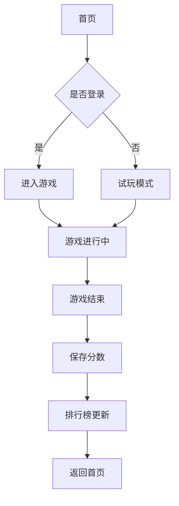

# 游戏集合平台 - 产品需求文档

## 1. 产品概述

**游戏集合平台**是一个融合了多个经典小游戏的在线游戏中心，专注于为用户提供简单、快捷、有趣的休闲游戏体验。

- **核心目的**: 整合多款经典小游戏（俄罗斯方块、贪吃蛇、打砖块、记忆翻牌），提供统一的登录、分数记录和排行榜系统
- **目标用户**: 休闲游戏爱好者，喜欢在碎片时间玩简单游戏的用户
- **产品价值**: 一站式游戏平台，用户可以轻松切换不同游戏，查看自己在各个游戏中的表现排名

## 2. 核心功能

### 2.1 用户角色

| 角色 | 注册方式 | 核心权限 |
|------|----------|----------|
| 访客 | 无需注册 | 浏览首页、试玩演示模式（分数不记录） |
| 注册用户 | 邮箱+密码注册 | 完整游戏体验、分数记录、排行榜、个人历史记录 |

### 2.2 功能模块

1. **首页**: 游戏展示卡片、热门游戏推荐、用户快速入口
2. **游戏中心**: 四款精选小游戏的完整游戏界面
3. **登录注册**: 邮箱注册、登录、登出功能
4. **排行榜**: 各游戏的全局排行榜，显示Top 10玩家
5. **个人中心**: 用户历史分数、游戏统计

### 2.3 页面详情

| 页面名称 | 模块名称 | 功能描述 |
|----------|----------|----------|
| 首页 | Hero区域 | 动态背景、欢迎文案、快速进入游戏按钮 |
| 首页 | 游戏卡片展示 | 4个游戏卡片，点击进入对应游戏 |
| 首页 | 排行榜预览 | 显示各游戏第一名玩家信息 |
| 游戏页 | 游戏画布 | Canvas实现的游戏主界面 |
| 游戏页 | 分数显示 | 实时分数、游戏时间、等级显示 |
| 游戏页 | 控制面板 | 开始/暂停/重新开始按钮 |
| 排行榜页 | 全局排行榜 | Tab切换不同游戏，显示Top 10 |
| 个人中心 | 历史记录 | 用户在各游戏的历史最高分 |
| 登录注册 | 表单模块 | 邮箱、密码输入，表单验证 |

## 3. 核心流程

### 3.1 用户游戏流程

```
用户访问首页 → 选择游戏 → 进入游戏页 → 开始游戏 → 结束游戏 → 分数保存 → 查看排行榜
```

### 3.2 用户认证流程

```
访客浏览首页 → 点击"登录" → 输入邮箱密码 → 登录成功 → 可保存分数
```

### 3.3 流程图



## 4. 用户界面设计

### 4.1 设计风格

**主题**: 赛博朋克霓虹风格（Cyberpunk Neon）

- **主色调**: 深空黑 `#0a0a0f` 作为背景
- **次要色**: 深灰 `#1a1a2e` 用于卡片背景
- **强调色**:
  - 霓虹粉 `#ff2a6d` - 主要操作按钮
  - 霓虹蓝 `#05d9e8` - 辅助元素
  - 霓虹紫 `#7b2cbf` - 装饰元素
- **文字色**:
  - 主文字: 纯白 `#ffffff`
  - 次要文字: 浅灰 `#a0a0a0`

**字体**:
- 标题: Orbitron（科技感几何字体）
- 正文: Rajdhani（现代简洁）

**布局**:
- 桌面端: 网格布局，最多4列游戏卡片
- 移动端: 单列流式布局，卡片全宽
- 使用CSS Grid和Flexbox实现

**动效**:
- 卡片悬停: 霓虹边框发光效果
- 页面切换: 淡入淡出过渡
- 分数更新: 数字滚动动画
- 霓虹闪烁: 微妙的呼吸灯效果

**图标风格**:
- 使用Lucide React图标库
- 保持简洁线条风格
- 霓虹色描边

### 4.2 页面设计

#### 首页布局

```
┌─────────────────────────────────────┐
│           Navigation Bar             │
│  [Logo]    [游戏] [排行榜] [个人]    │
├─────────────────────────────────────┤
│                                     │
│        ╔═══════════════════╗        │
│        ║   GAME CENTER     ║        │
│        ║   游戏集合平台      ║        │
│        ╚═══════════════════╝        │
│                                     │
│  ┌─────┐ ┌─────┐ ┌─────┐ ┌─────┐   │
│  │ 🎮  │ │ 🐍  │ │ 🧱  │ │ 🃏  │   │
│  │俄罗斯│ │贪吃 │ │打砖 │ │记忆 │   │
│  │方块  │ │蛇   │ │块   │ │翻牌 │   │
│  └─────┘ └─────┘ └─────┘ └─────┘   │
│                                     │
│  ┌─────────────────────────────┐    │
│  │   排行榜预览 - 本周冠军 🏆    │    │
│  └─────────────────────────────┘    │
│                                     │
└─────────────────────────────────────┘
```

#### 移动端布局

```
┌─────────────────┐
│    Navigation    │
├─────────────────┤
│                 │
│   Hero Title    │
│                 │
│  ┌───────────┐  │
│  │   游戏1    │  │
│  └───────────┘  │
│  ┌───────────┐  │
│  │   游戏2    │  │
│  └───────────┘  │
│  ┌───────────┐  │
│  │   游戏3    │  │
│  └───────────┘  │
│  ┌───────────┐  │
│  │   游戏4    │  │
│  └───────────┘  │
│                 │
└─────────────────┘
```

### 4.3 响应式设计

**断点设置**:
- 移动端: `< 768px`
- 平板端: `768px - 1024px`
- 桌面端: `> 1024px`

**触控优化**:
- 触摸友好的按钮尺寸（最小44x44px）
- 游戏支持触屏滑动/点击控制
- 足够大的点击区域

## 5. 游戏设计

### 5.1 俄罗斯方块 (Tetris)

- **玩法**: 旋转下落的方块，填满整行消除得分
- **操作**:
  - 桌面: 方向键控制
  - 手机: 屏幕触摸滑动
- **分数规则**: 消除行数越多分数越高
- **难度递增**: 每10行速度加快

### 5.2 贪吃蛇 (Snake)

- **玩法**: 控制蛇移动，吃食物增长，得分
- **操作**:
  - 桌面: 方向键
  - 手机: 触摸方向按钮
- **分数规则**: 每个食物10分
- **游戏结束**: 撞墙或撞自己

### 5.3 打砖块 (Breakout)

- **玩法**: 控制挡板反弹小球，击碎砖块
- **操作**:
  - 桌面: 鼠标/方向键
  - 手机: 触摸拖动
- **分数规则**: 不同颜色砖块不同分数
- **关卡设计**: 3种难度级别

### 5.4 记忆翻牌 (Memory Match)

- **玩法**: 翻开卡牌找到配对，记忆卡牌位置
- **操作**: 点击/触摸翻转卡牌
- **分数规则**: 用时越少分数越高
- **难度**: 4x4网格，8对卡牌

## 6. 数据存储

### 6.1 本地存储策略

**使用 localStorage 存储**:
- 用户登录状态（JWT Token）
- 用户信息（邮箱、昵称）
- 游戏分数记录（各游戏最高分、历史记录）
- 排行榜缓存

### 6.2 数据结构

```typescript
interface User {
  email: string;
  nickname: string;
  createdAt: number;
}

interface GameScore {
  gameId: string;
  score: number;
  timestamp: number;
}

interface Leaderboard {
  gameId: string;
  entries: Array<{
    rank: number;
    nickname: string;
    score: number;
    timestamp: number;
  }>;
}
```

## 7. 技术实现

详见技术架构文档
